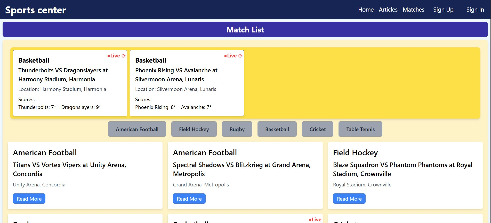
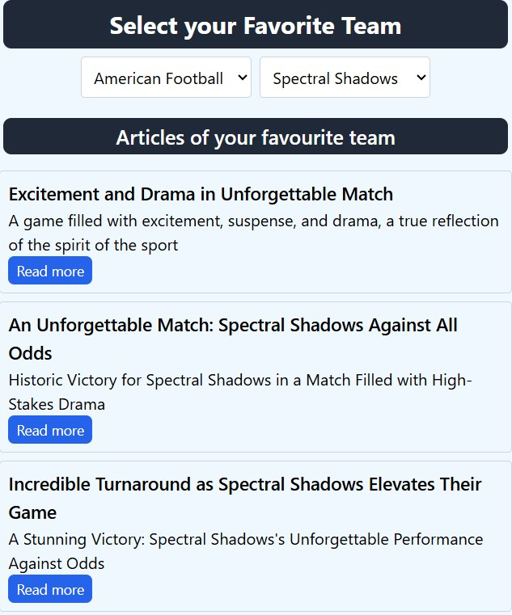
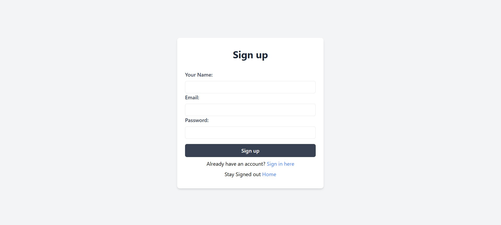
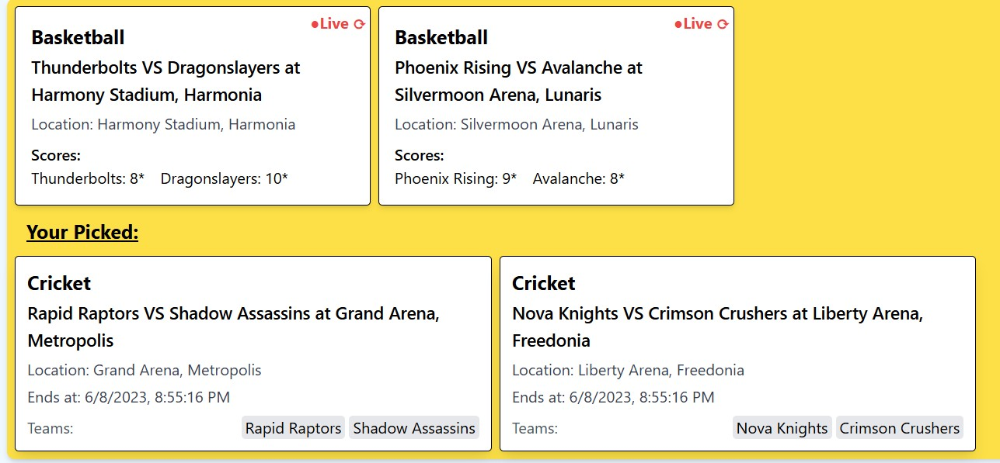

# Sports News and Scores Dashboard

A comprehensive React-based web application for sports enthusiasts to stay updated with the latest news, live scores, and personalized content.

## 📋 Overview

The Sports News and Scores Dashboard is a modern web application built with React as part of the Web Development 301 capstone project. It provides users with an intuitive platform to browse sports news, view live scores, filter content by sport and team, and personalize their dashboard experience. The application is designed to be user-friendly, responsive, and production-ready, catering to both dedicated sports enthusiasts and casual users.

## ✨ Features

### Core Features

- **📰 Browse Sports News**: View a comprehensive list of articles with titles, summaries, and thumbnails. Click "Read More" to access the full article content in an interactive modal.

- **🔍 Filter News Articles**: Seamlessly filter articles by sport using intuitive tabs, with dynamic updates that don't require page reloads.

- **📊 View Live Scores**: Access real-time information about ongoing matches, including team names, current scores, and match status. Features a manual refresh button for instant score updates.

- **👤 Personalize Dashboard**: Create an account, sign in securely, and set preferences for favorite sports and teams to receive tailored news and scores that match your interests.

### Optional Features (Planned)

- 💾 Save favorite articles and matches for quick access
- 🔐 Allow users to change their account passwords
- 📱 Push notifications for favorite teams
- 📈 Sports statistics and analytics

## 🎨 User Interface

### Landing Screen
- Clean navigation bar displaying the app name
- Prominent sign-in/sign-up links for easy access
- Live scores section showing the last 5 matches
- Trending news section with organized sport tabs

### Authentication Pages
- Dedicated sign-in and sign-up pages accessible via the navigation bar
- Secure user authentication with form validation
- Clean, modern design consistent with the overall app theme

### Article Detail View
- Full-screen modal displaying complete article content
- High-quality images and optimized typography
- Smooth transitions and user-friendly navigation

### Preferences Screen
- Modal interface for logged-in users
- Easy selection of favorite sports and teams
- Real-time preview of personalized content

### Responsive Design
- Fully responsive layout that adapts to different screen sizes
- Optimized for desktop, tablet, and mobile devices
- Consistent user experience across all platforms

## 🛠 Tech Stack

### Frontend
- **React**: Modern JavaScript library for building user interfaces
- **React Router**: Client-side routing for seamless navigation
- **CSS Modules**: Modular styling approach for component-specific styles
- **React Context**: State management for authentication and user preferences

### Backend Integration
- **WD301 Capstone API**: Integration with provided API endpoints for:
  - Articles management
  - Match data and live scores
  - Sports and teams information
  - User authentication and management

### Performance Optimizations
- **Code Splitting**: Implements React.lazy for optimal bundle sizes
- **Lazy Loading**: Components loaded on-demand for improved performance
- **Responsive Images**: Optimized image loading and display

## 🚀 Getting Started

## 📸 Screenshots

| Landing Page | Article Modal |
|:---:|:---:|
|  |  |
| *Trending news and live scores* | *Teams* |

| Sign In | Preferences |
|:---:|:---:|
|  |  |
| *User authentication* | *Customize your dashboard* |

## 🔧 Configuration

### API Integration
The application integrates with the WD301 Capstone API. Configure the following endpoints in your environment variables:

### Available API Endpoints
- `/api/articles` - Fetch sports articles
- `/api/matches` - Get live scores and match data
- `/api/sports` - Retrieve sports categories
- `/api/teams` - Access team information
- `/api/auth` - User authentication endpoints

## 🤝 Contributing

1. Fork the repository
2. Create a feature branch (`git checkout -b feature/amazing-feature`)
3. Commit your changes (`git commit -m 'Add amazing feature'`)
4. Push to the branch (`git push origin feature/amazing-feature`)
5. Open a Pull Request

## 📞 Support

If you have any questions or need help with the project:

- 📧 Email: alexjmt1@gmail.com

---

**🚀 Try It Out**
- [Live Demo](https://captone.netlify.app/home)
- [Video Walkthrough](https://www.youtube.com/watch?v=ZVPJnDvWhRs)

---

*Built with ❤️ for sports enthusiasts everywhere*
